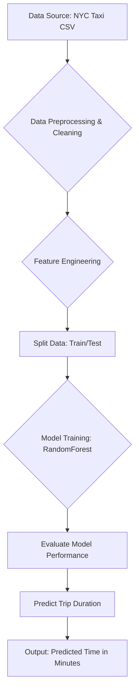

# AI-Powered NYC Taxi Trip Duration Prediction

### A Proof of Concept for Urban Mobility Insights

This project is a mini AI-powered system designed to predict the duration of taxi trips in New York City. The goal is to provide insights into traffic patterns that can help citizens, delivery services, and city planners improve urban mobility.

---

### 🎯 Business Problem Understanding

From a business perspective, accurately predicting trip duration is crucial for several stakeholders:

* **Citizens & Tourists:** Can get reliable ETAs for planning their schedules, choosing the best time to travel, and comparing ride-hailing app prices, which often depend on trip duration.
* **Delivery & Logistics Services:** Can optimize delivery routes, reduce fuel costs, and provide customers with more accurate delivery windows. This directly impacts operational efficiency and customer satisfaction.
* **City & Traffic Officials:** Can analyze prediction data to identify traffic congestion hotspots at different times of the day, plan infrastructure improvements, and manage traffic flow during major events.
* **Ride-Hailing Companies:** Can improve their ETA algorithms, manage driver allocation more effectively, and implement dynamic pricing strategies based on predicted traffic.

The core business value lies in **transforming raw location data into actionable intelligence** for time and cost savings.

---

### 🌊 Project Workflow

Here is the flowchart of our system, from data ingestion to final prediction.


*(This flowchart is made with Mermaid syntax, which renders automatically on GitHub.)*

---

### 🇮🇳 Implementation Plan for Indore

This NYC-based model can be adapted for Indore to tackle its unique mobility challenges.

1.  **Data Acquisition:** The primary requirement is GPS data. This can be sourced from:
    * **Partnerships:** Collaborate with local ride-hailing services (like Ola, Uber), auto-rickshaw unions, or bus services (Atal Indore City Transport Services Ltd) to get anonymized trip data (pickup/dropoff coordinates and timestamps).
    * **Public Datasets:** Utilize any available open-source traffic data from municipal corporations or smart city initiatives.

2.  **Feature Adaptation:** While core features like `time of day` and `day of week` remain relevant, new Indore-specific features would be critical:
    * **Local Events:** Add features for festival days (e.g., Diwali, Ahilya Utsav), public holidays, or major events at the Holkar Stadium, which significantly impact traffic.
    * **Road Type:** Differentiate between major roads (like AB Road), narrow inner-city lanes, and the BRTS corridor.
    * **Weather:** Incorporate real-time weather data, as monsoon rains heavily affect Indore's traffic.

3.  **Expected Benefits:**
    * **Citizens:** Get realistic travel time estimates, especially when navigating through congested areas like Rajwada or Sarafa Bazaar.
    * **iBus (BRTS):** Optimize bus frequency and scheduling based on real-time traffic predictions along its corridor.
    * **Indore Municipal Corporation:** Identify key congestion points to plan for new flyovers, traffic signals, or one-way street implementations.

---

### 🚀 How to Run the Proof of Concept (POC)

1.  **Prerequisites:** Ensure you have Python and the following libraries installed:
    ```bash
    pip install pandas numpy scikit-learn jupyterlab
    ```
2.  **Download Data:** Place the `train.csv` from the Kaggle competition into the same directory as the notebook.
3.  **Launch Jupyter:** Open your terminal, navigate to the project folder, and run `jupyter lab`.
4.  **Run Notebook:** Open the `.ipynb` file and click "Run All" to see the entire process from data loading to prediction.
